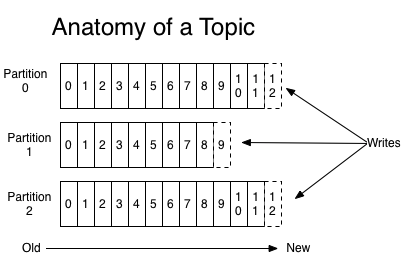

# Kafka Notes

The Kafka cluster stores streams of records in categories called topics. Each record consists of a key, a value, and a timestamp



Kafka comes with five core APIs:
* **Producer** API allows **publish** of stream of records to one or more topics
* **Consumer** API allows **subscribe** to one or more topics and process stream of records published to them
* **Streams** API allows **consuming input** stream from one or more topics and **producing** them to one or more **output** topics
* **Connector** API allows building producer or consumer that **connect topics to existing applications / data systems**
* **Admin** API managing topics, brokers, other objects

## Topics and Logs

Topic is a category which records are published. 

Each topic maintains a partitioned log



Each partition is an ordered, immutable sequence of records that is continually appended to—a structured commit log.

Partition acts as a unit of parallelism

## Producer

The producer is responsible for choosing which record to assign to which partition within the topic. Can be done according to some semantic partition function (say based on some key in the record)

## Consumers

Consumers label themselves with a consumer group name, and each record published to a topic is delivered to one consumer instance within each subscribing consumer group


## Commands
```
./kafka-topics.sh --describe --zookeeper my-kafka-zookeeper:2181 --topic my-replicated-topic

./kafka-console-producer.sh --topic my-replicated-topic --broker-list my-kafka:9092

 ./kafka-topics.sh --create --zookeeper my-kafka-zookeeper:2181 --replication-factor 3 --partitions 1 --topic my-replicated-topic
 ```
